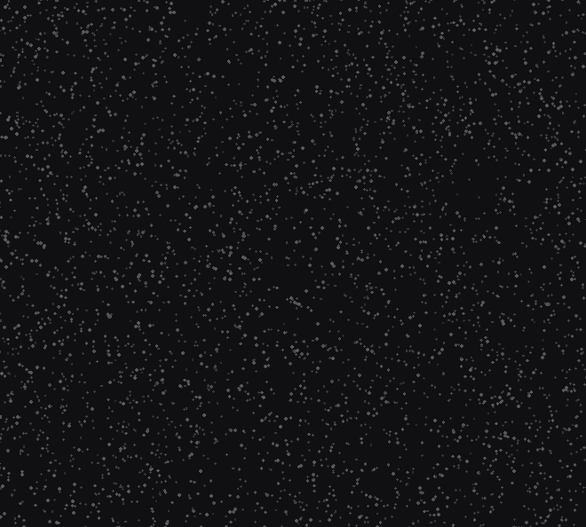

<div align="center">




# Ashok Kumar

<a href="https://github.com/ashoka-2">

</a>

<sub>Kerala, India &nbsp;|&nbsp; BCA student &nbsp;|&nbsp; call me **Ashok Bhai**</sub>

<br>

<a href="https://github.com/ashoka-2"></a>
<a href="https://linkedin.com/in/YOUR_USERNAME"></a>
<a href="YOUR_PORTFOLIO_URL"></a>

</div>

<br>

## About

I'm a BCA student from Kerala, curious about **software engineering, AI, modern web technology, UI/UX and creative technology**.

I learn by building. I like trying new ideas, understanding *why* something works, and joining engineering with visual design, so the things I make are fast, clear and feel good to use.

> **Good software should not only work. It should feel good to use.**

<table>
<tr>
<td width="50%" valign="top">

**Studying**  
Bachelor of Computer Applications  
Sree Narayana Guru College of Advanced Studies  
Thottada, Kannur, Kerala

</td>
<td width="50%" valign="top">

**Interested in**  
Full-stack and mobile development  
Generative AI and AI agents  
Computer vision  
Motion design and interactive interfaces

</td>
</tr>
</table>

<br>

## Tools I work with

<div align="center">

<sub>Languages</sub><br>


<sub>Development</sub><br>


<sub>Interface and motion</sub><br>

<br>


<sub>Engineering</sub><br>


<sub>AI</sub><br>


</div>

<br>

## Where I'm heading

<div align="center">

**Software engineering** &rarr; **Artificial intelligence** &rarr; **Modern web** &rarr; **UI and UX** &rarr; **Motion and interaction** &rarr; **Creative technology**

</div>

My goal is to be a developer who moves comfortably between engineering, AI and creative development.

```text
learn -> experiment -> build -> break -> understand -> improve -> build again
```

<br>

## GitHub activity

<div align="center">


<br>


<br>


</div>


